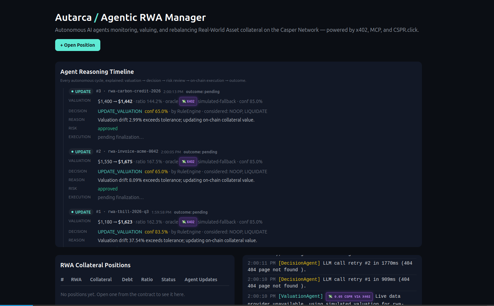
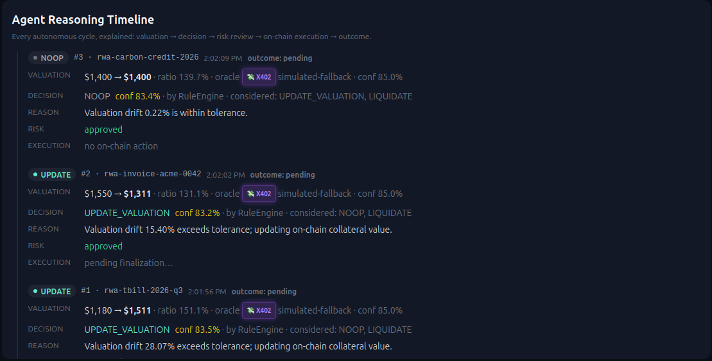
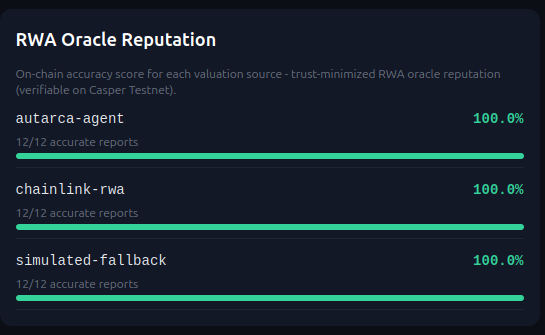
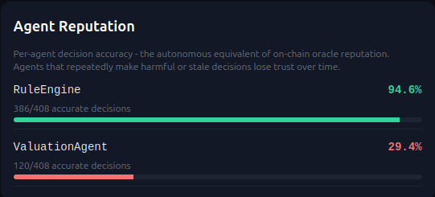
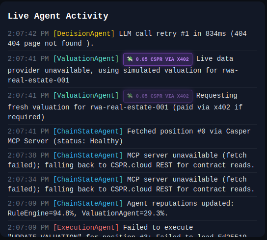
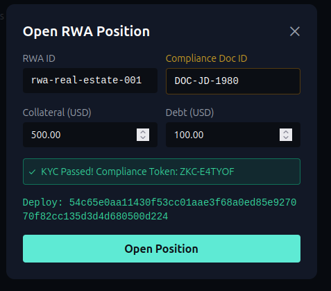

<div align="center">

# Autarca

### My RWA Collateral & Yield Manager on Casper Network

**An autonomous, AI-driven pipeline that I built to keep tokenized real-world asset collateral trustworthy, liquid, and safe.**

My submission for the **Casper Agentic Buildathon 2026** — Final Round.

[](https://casper.network)
[](https://odra.dev)
[](https://www.typescriptlang.org)
[](https://nextjs.org)
[](https://x402.org)
[](LICENSE)
[](.github/workflows/ci.yml)

[Live Demo](#live-demo) · [Architecture](#architecture) · [Why I Built Autarca](#why-i-built-autarca) · [Why Casper](#why-casper) · [Demo Flow](#demo-flow) · [Roadmap](#roadmap)

</div>

---

## Screenshots

> Place the following captures in `docs/screenshots/` and the README will render them automatically.

| Dashboard | Agent Reasoning Timeline | Oracle Reputation |
|---|---|---|
|  |  |  |

| Agent Reputation | Live Activity Feed | Open Position Modal |
|---|---|---|
|  |  |  |

---

## Why I Built Autarca

Tokenized real-world assets (RWAs) are the next trillion-dollar wave in DeFi — real estate, treasury bills, invoices, carbon credits. But when I looked at RWA collateral, I realized it has a fatal flaw that pure crypto collateral does not:

> **The value of an RWA changes off-chain, and nobody is watching.**

Today, when an RWA position drifts out of safe collateral ratios, a human operator has to notice, fetch a fresh appraisal, decide whether to revalue or liquidate, and sign a transaction. That loop is slow, centralized, and trust-dependent. It is exactly the kind of brittle, manual process that causes systemic failures in lending markets.

**I built Autarca to replace that human with a transparent, auditable, on-chain AI agent pipeline.**

| Traditional RWA Lending | Autarca |
|---|---|
| Manual valuation refresh (days/weeks) | Autonomous valuation refresh every cycle |
| Human decides liquidation | AI Decision Agent with confidence + alternatives |
| No second opinion | Risk Swarm consensus on low confidence |
| Opaque reasoning | Full reasoning timeline published to dashboard |
| No track record for data sources | On-chain Oracle Reputation scoring |
| No track record for the agent itself| On-chain Agent Reputation scoring |
| Trust the operator | Verify the agent, the oracle, and the outcome |
| Single point of failure | Circuit breakers, retries, safe fallbacks |

---

## Feature Checklist

- [x] **Autonomous valuation refresh** via x402 micropayments
- [x] **AI Decision Agent** with confidence scores, alternatives, and yield routing
- [x] **Risk Swarm Consensus** — specialized agents (Liquidity, Volatility, Counterparty) voting on actions
- [x] **AI Compliance / KYC Gate** — mock document validation to open positions
- [x] **Agent Memory** — decision history, valuation volatility, trend tracking
- [x] **Agent Reputation** — per-agent accuracy scoring with outcome heuristics
- [x] **Oracle Reputation** — on-chain per-source accuracy scoring
- [x] **Explainability Timeline** — full reasoning chain per cycle in the dashboard
- [x] **Resilience** — safe JSON parsing, exponential backoff retries, timeouts, circuit breakers
- [x] **On-chain Execution** — signed deploys to AutarcaVault on Casper Testnet
- [x] **Live Dashboard** — glowing x402 activity, positions, on-chain actions, reputation
- [x] **CI/CD** — cargo fmt/clippy/test, agent build/test, frontend lint/build, testnet deploy workflow

---

## Why Casper?

I chose to build Autarca natively on Casper because it gives me the exact primitives an autonomous RWA pipeline needs—something no other chain combines so effectively:

1. **Odra Smart Contract Framework** — ergonomic Rust contracts with first-class testing. The `AutarcaVault` and `OracleReputation` contracts are written in Odra and compile to Casper WASM.
2. **Casper MCP Server** — my agents read live chain state (positions, collateral ratios, oracle reputation) through the Model Context Protocol, the same standard used by AI agents everywhere. This makes the agent a first-class citizen of the Casper stack.
3. **CSPR.cloud REST + Streaming APIs** — the dashboard pulls live positions, deploys, and block data directly from CSPR.cloud without needing a node.
4. **x402 Micropayment Protocol** — the Valuation Agent pays per-appraisal over HTTP 402, settling each request on-chain. This is the ultimate payment rail for autonomous agents buying data.
5. **CSPR.click Wallet Integration** — users can open RWA positions directly from the dashboard using a secure Casper wallet.
6. **Testnet Finality and Predictable Gas** — the Execution Agent signs and broadcasts deploys that finalize in seconds, making my autonomous loop highly responsive.

For me, Casper isn't just the settlement layer — it is the **data layer** (MCP + CSPR.cloud), the **payment layer** (x402), and the **wallet layer** (CSPR.click) for the entire pipeline.

---

## Architecture

```
                    ┌─────────────────────────────────────────────┐
                    │                  DASHBOARD                   │
                    │   Next.js + TailwindCSS + WebSockets        │
                    │                                             │
                    │  Agent Reasoning Timeline  (explainability) │
                    │  Glowing x402 Micropayments                 │
                    │  Oracle Reputation  ·  Agent Reputation      │
                    │  Live Activity Feed  ·  Compliance KYC Gate  │
                    └───────────────────┬─────────────────────────┘
                                        │ WebSocket (ws://localhost:4100)
                                        │ CSPR.cloud REST
                                        ▼
   ┌────────────────────────────────────────────────────────────────────┐
   │                         AGENT RUNTIME (Node/TS)                     │
   │                                                                    │
   │  ┌──────────────┐   ┌──────────────┐   ┌────────────────┐         │
   │  │ Valuation    │──▶│ Decision     │──▶│ Risk Swarm     │         │
   │  │ Agent        │   │ Agent        │   │ (Liquidity,    │         │
   │  │ (x402 pay)   │   │ (Yield/Liq)  │   │  Volatility,   │         │
   │  └──────┬───────┘   └──────┬───────┘   │  Counterparty) │         │
   │         │                  │           └──────┬─────────┘         │
   │         │            ┌─────┴────────┐         │                   │
   │         │            │ Agent Memory │         │                   │
   │         │            │ (history,    │   ┌─────▼────────┐          │
   │         │            │ volatility,  │   │ Execution    │          │
   │         │            │ reputation)  │   │ Agent        │          │
   │         │            └─────────────┘    └─────┬────────┘          │
   │         ▼                                     ▼                   │
   │  ┌──────────────┐                     ┌──────────────┐            │
   │  │ x402 Client  │                     │ MCP Client   │            │
   │  │ (pay + fetch)│                     │ (chain state)│            │
   │  └──────────────┘                     └──────┬───────┘            │
   └───────────────────────────────────────────────┼───────────────────┘
                                                   │
                                                   ▼
   ┌────────────────────────────────────────────────────────────────────┐
   │                      CASPER TESTNET                                │
   │                                                                    │
   │   AutarcaVault (Odra/Rust)        OracleReputation (Odra/Rust)     │
   │   - open_position                 - record_valuation               │
   │   - agent_update_valuation        - get_reputation                 │
   │   - agent_liquidate               - accuracy tolerance check       │
   │   - agent_allocate_yield                                           │
   └────────────────────────────────────────────────────────────────────┘
```

### Repository Layout

```
Autarca/
├── contracts/        # Odra (Rust): AutarcaVault + OracleReputation
├── agent/            # Node/TS runtime: x402, MCP, decision, swarm, execution
├── frontend/         # Next.js dashboard: CSPR.cloud, reasoning, x402 feed
├── scripts/          # deploy_testnet.sh, get_contract_hash.sh, seed positions
├── docs/             # architecture notes, demo script, screenshots
└── .github/workflows # CI + manual testnet deploy
```

---

## My Innovations

Autarca is not just "another RWA lending app." My core innovation is building an **autonomous, explainable, reputation-scored system**:

1. **Yield-Routing Focus (Offense)** — Instead of just playing defense (liquidating), the Decision Agent allocates excess collateral to yield-bearing DeFi protocols, acting as an active portfolio manager.
2. **Risk Swarm Consensus** — Decisions are vetted by a swarm of specialized LLM personas (Liquidity, Volatility, Counterparty) arriving at a weighted consensus.
3. **Agent Memory** — The agent remembers every decision. It computes volatility and tracks outcomes contextually. The next decision is made *in context*, not from scratch.
4. **Confidence + Alternatives** — Every decision carries a `confidence` score (0..1) and an `alternativesConsidered` list. The dashboard shows what the agent did, *what else it could have done*, and *how sure it was*.
5. **Dual Reputation System** —
   - **Oracle Reputation** (on-chain): Each valuation source's historical accuracy is recorded in the `OracleReputation` contract.
   - **Agent Reputation** (in-memory + dashboard): Each agent's decisions are scored by outcome heuristics.
6. **AI Compliance / KYC** — An off-chain compliance agent verifies user profiles before RWA minting, keeping private data off-chain while producing actionable trust tokens via Casper.
7. **x402 as the Payment Rail** — The system visually highlights real x402 micropayments paying for API appraisals, proving the viability of autonomous agents buying data.

---

## Oracle Reputation

The `OracleReputation` contract lives on Casper Testnet alongside the `AutarcaVault`. Every time the Valuation Agent fetches a fresh appraisal, the source is recorded. It tracks total reports, accurate reports, and derived accuracy ratios.

The dashboard reads these scores live from CSPR.cloud. Sources are configurable via the `NEXT_PUBLIC_KNOWN_SOURCES` env var.

---

## Demo Flow

You can run a complete end-to-end demo of my project in under five minutes:

1. **Deploy the contract** to Casper Testnet.
2. **Seed four realistic RWA positions** (real estate, T-bill, invoice, carbon credit).
3. **Start the agent runtime** (`npm run dev` in `agent/`). Watch the lifecycle: x402 fetching, chain state reading, decision making, swarm vetting, and deploy execution.
4. **Start the dashboard** (`npm run dev` in `frontend/`). Open `http://localhost:3000`:
   - Watch the **Agent Reasoning Timeline** fill in cycle-by-cycle.
   - See the glowing **x402 micropayments** pop up.
   - Try to open a position yourself, passing the **AI Compliance Gate**.
5. **Trigger a liquidation or yield allocation** by seeding extreme positions and watching the agents autonomously react.

---

## Open Position Signing: Why Agent Signed Deploys

The "Open Position" button in the dashboard submits an `open_position` deploy to the `AutarcaVault` contract on Casper Testnet. There are two ways this deploy can be signed:

| Option | How it works | Pros | Cons |
|---|---|---|---|
| **Option A — Agent signed (chosen)** | The Next.js API route loads the agent's PEM key server side, signs the deploy with `casper-js-sdk`, and broadcasts it. | Mirrors the Execution Agent's responsibility (sign + broadcast). No browser wallet extension needed. Works for any judge with one click. Demonstrates the full autonomous pipeline: judge opens position → agent detects it → Valuation Agent runs → Decision Agent reasons → Risk Agent approves → Execution Agent updates. | The agent key is used for the initial seed. In production, the agent key would only sign autonomous actions, and users would sign their own `open_position` deploys. |
| **Option B — CSPR.click wallet signed** | The dashboard connects to the user's Casper Wallet via CSPR.click, the user signs the deploy in the browser, and the dashboard submits the signed deploy. | True user custody: the user signs with their own key. Matches production DeFi UX. | Requires the Casper Wallet browser extension installed. Adds friction to the demo (judges must install an extension, create a testnet wallet, fund it). Breaks the seamless "one click → full pipeline" demo flow. |

**Why we chose Option A for the Buildathon demo:**

1. **Architectural consistency** — the Execution Agent's defined responsibility is to sign and broadcast deploys. Option A mirrors that exact flow in the Open Position path, so the demo shows one coherent signing model throughout.
2. **Frictionless demo** — judges click "Open Position" and immediately see a deploy hash, finalization, and the autonomous pipeline reacting to the new position. No wallet installation, no testnet CSPR funding, no extension setup.
3. **Pipeline visibility** — the whole point of the demo is to show the agent loop (Valuation → Decision → Risk → Execution). Option A gets a position on chain in one click so the agent loop has something to act on immediately.
4. **Production path is documented** — Option B is the production path. The route's docstring and this README section document it explicitly. Swapping to CSPR.click signing is a frontend only change (replace the server side `loadKeys()` call with a browser wallet `sign()` call); the contract and agent runtime are unchanged.


## Security & Resilience

- **Safe JSON parsing** — I built `safeJsonParse` to extract JSON from noisy LLM output via regex, failing gracefully.
- **Retry with backoff** — `withRetry` uses exponential backoff plus jitter.
- **Circuit breakers** — A `CircuitBreaker` trips open after repeated failures, degrading gracefully to a rule-based fallback instead of crashing the pipeline.
- **On-chain guards** — `AutarcaVault` enforces strict ratios and only whitelisted agent keys can execute operations.

---

## Getting Started

### Quick start (End-to-End Demo)

```bash
# 1. Build + deploy the contract to Casper Testnet
cd contracts && cargo odra build -b casper
CASPER_NODE_RPC_URL=https://node.testnet.casper.network/rpc \
DEPLOYER_SECRET_KEY="$(cat ~/keys/secret_key.pem)" \
AGENT_PUBLIC_KEY_HEX=01... \
  ../scripts/deploy_testnet.sh --wasm wasm/AutarcaVault.wasm --min-ratio-bps 15000 --accuracy-tolerance-bps 200

# Resolve the contract hash after finalization:
./scripts/get_contract_hash.sh <deploy-hash>

# 2. Seed realistic RWA positions
cd ../agent && npm install && npm run seed

# 3. Start the runtime components
npm run dev

# 4. Start the dashboard
cd ../frontend && npm install && npm run dev
# open http://localhost:3000
```

---

## My Roadmap & Contribution to Casper

Autarca is built to give back to the Casper ecosystem. My vision extends beyond this buildathon:

1. **Open Source RWA Valuation Oracle:** The valuation pipeline is designed as a reusable Casper MCP tool so other dApps can consume trust-scored RWA data.
2. **x402 Agent Payment Pattern:** I've created a reference implementation of an autonomous agent paying for data over HTTP 402, settling on Casper.
3. **Agent Reputation Primitive:** A novel on-chain + in-memory reputation system that other Casper agent builders can adopt.
4. **Odra Reference:** `AutarcaVault` and `OracleReputation` serve as high-quality Odra examples for the community.

**Go-to-Market Strategy:**
- **Phase 1 (Now):** Open-source reference pipeline + community feedback.
- **Phase 2 (Q4 2026):** Partner with Casper ecosystem RWA issuers to run pilots with real valuation feeds gated by the on-chain oracle reputation.
- **Phase 3 (2027):** Launch on Casper Mainnet with a DAO-governed parameter set.

---

## Links

- **GitHub:** https://github.com/autarca/autarca
- **Demo video:** https://youtube.com/@autarca
- **Twitter/X:** https://twitter.com/autarca_xyz
- **Landing page:** https://autarca.xyz

---

## License

MIT
